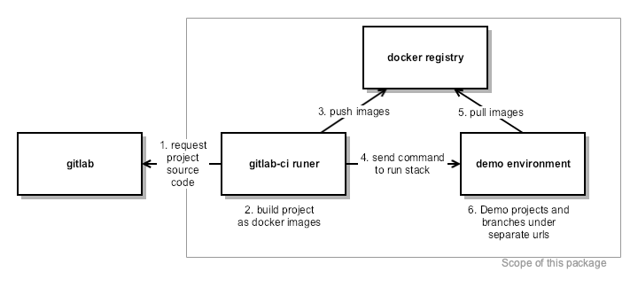
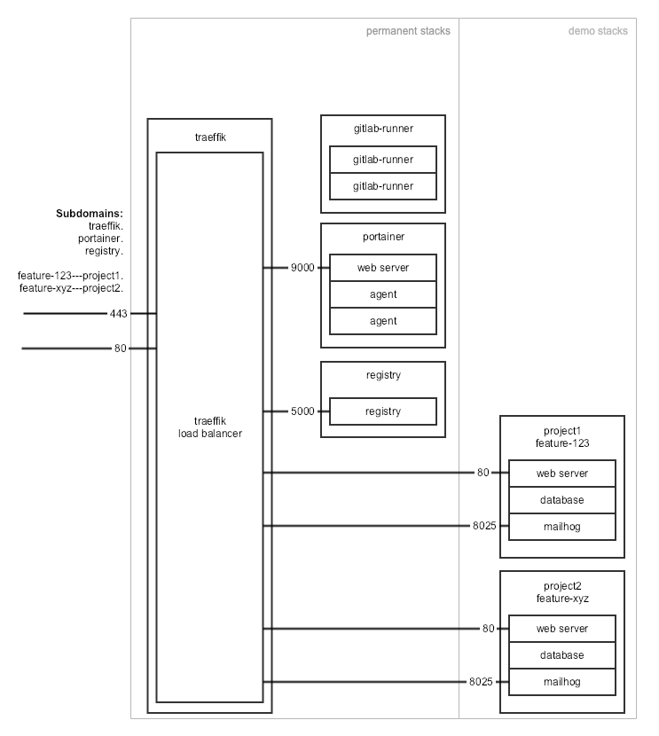

# CI environment

This code provisions an environment to build and demo docker based projects in a docker swarm.
The primary intention is to demo multiple web projects with all open branches, reachable via separate URLs. 

For a 2 projects `project1` and `project2` the accessible URLs may be as follows:

* https://master---project1.demo.example
* https://feature-123---project1.demo.example
* https://master---project2.demo.example
* https://feature-xyz---project2.demo.example

Requirements:
* [Docker swarm](https://docs.docker.com/engine/swarm/) cluster
    * based on docker engine 18.04 or higher
    * accessible via SSH
* Domain for the demo server. The DNS of the domain needs to be served by GoDaddy
* Gitlab server, to connect the gitlab runners to

Conceptually, this package can be split up into three parts:

* Build cluster (gitlab-ci runners)
* Artifact storage (docker image registry)
* Demo cluster

The build of a project can be seen here:

Allthough they could theoretically be split up into several docker swarms (build, store, demo), all three parts will be provisioned in the same docker swarm. 

## Stacks

To build, store and demo docker based projects, this CI environment arranges several preexisting packages in a docker swarm:

| component     | role |
| ------------- | ---- |
| portainer     | To visualize the status of the docker swarm | https://github.com/portainer/portainer |
| gitlab-runner | To build projects as docker images |  https://hub.docker.com/r/gitlab/gitlab-runner/ |
| registry      | To store the images | https://hub.docker.com/_/registry |
| traeffik      | as a load balancer, to make the services and demo stacks available via https | https://github.com/containous/traefik |

This project provisions the permanent parts of the CI environment. The demo projects will be added as seperate stacks to the same cloud. 

## Traeffik
Traeffik acts as a reverse proxy for the docker swarm and routes inbound requests to the respective services. These services can be part of the permanent stacks (such as portainer.demo.example, or registry.demo.example) or demo stacks. 

## Setup

The `install.sh` script expects a number of environment variables to be set:

| Env variable | Description | Sample |
| ------------ | ------ | ------ |
| DEMO_SERVER_HOSTNAME | Hostname of the CI environment | demo.example |
| ADMIN_AUTH_USERNAME | username for portainer, traefik, … | admin |
| ADMIN_AUTH_PASSWORD | password for portinaer, traefik, … | mysecretpassword |
| GODADDY_API_KEY | API Key for the GoDaddy DNS Service | omdhj235_koemdh84623ndfbw |
| GODADDY_API_SECRET | API Secret for the GoDaddy DNS Service | 123SECRET123i5z231z |
| CI_SERVER_URL | URL of the gitlab server | https://git.my-company.example |
| REGISTRATION_TOKEN | Gitlab Runner registration token | kdherhSECRET728126123 |

